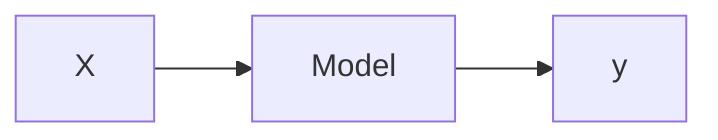

## Idea

A model is something that links inputs to outputs. If we are given data, $X \in \mathbb{R}^{NxD}$, and observations, $y$, we ideally would want to know these two entities are related. That relationship (or transformation) from the data $X$ to the observations $y$ is what we would call a model, $\mathcal{M}$. 

More concretely, let $X\in \mathbb{R}^{NxD}$ and $y \in \mathbb{R}^{N}$ where $N$ is the number of samples and $D$ is the number of dimensions/features. In a transformation sense, we could think of it as a function, $f$ that maps the data from $X$ to $y$, or $f:\mathbb{X}\rightarrow \mathbb{Y}, \mathbb{R}^{NxD}\rightarrow \mathbb{R}^{N}$. To put it simply, we have the following equation to describe our model.

$$y = f(X)$$

But if we put a statistical spin on it and say that $X$ is a random variabe (r.v.), $X \sim \mathbb{P}$. We typically don't know $\mathbb{P}$ or else there really would not be a problem. Or even worse, let's say that there is actually noise in our observation so we're not entirely 100% sure that each input, $x$ corresponds to each output, $y$. Fortunately, we have mathematics where we can easily find some mathematical framework to transform our problem into a way we can easily solve. In this case, we can use the mathematics of probability theory to express the uncertainty and noise that come with our model, $\mathcal{M}$. More specifically, we can use Bayes rule to give us inverse probabilities that allow us to use inference; basically using our data to infer unknown quantities, model aspects and (most importantly) make predictions.

#### Bayes Rule in Words

In a Machine Learning problem, we almost always have the following components:

* Data 
* Model which we believe can describe our data, 
  * parameters which can be changed/tuned to fit the data 
* Goal 
  * Learn the parameters given the data
  * which points belong to which cluster
  * predict function outputs
  * predict future labels
  * predict the lower dimensional embedding/representation

The Bayesian framework works best when you think about it from a probabilistic standpoint. 

$$\begin{aligned}P(\text{ Model }|\text{ Data })=
\frac{P(\text{ Data }|\text{ Model })P(\text{ Model })}{P(\text{ Data })}\end{aligned}$$

> I've seen some people ([here](https://work.caltech.edu/library/012.html), [here](https://youtu.be/5KdWhDpeQvU?t=1310)) have some sort of equivalence between Model, $\mathcal{M}$ and Hypothesis, $\mathcal{H}$. In this particular instance, think of the $\mathcal{M}$ as the best possible outcome that we can achieve to map $x$ to $y$ **correctly**. And think of $\mathcal{H}$ as a set of possible formulas we could use; like in a Universe where we have all of the possible formulas and collection of parameters. I quite like the term Hypothesis because it adds another level of abstraction when thinking about the problem. But at the same time I feel like this extra layer of abstraction is not something I like to think about all of the time.

Let's break down each of these components.

* $P(\text{ Model })$ - Prior Probability
* $P(\text{ Data } | \text{})$ - Evidence, Normalization Constant 
* $P(\text{ Model } | \text{ Data })$ - Posterior Probability
* $P(\text{ Data } | \text{ Model })$ - Likelihood

Let's change the notation to something a bit more common.

$$P(\theta | \mathcal{D}, \mathcal{M})=
\frac{P(\mathcal{D}|\theta, \mathcal{M})P(\theta | \mathcal{M})}{P(\mathcal{D}|\mathcal{M})}$$

where:
* $P(\mathcal{D}|\theta, \mathcal{M})$ - Likelihood of the parameters, $\theta$ in model $\mathcal{M}$
  
  > Likelihood of the parameters (**not of the data**). For every set of parameters, I can assign a probability to some observable data.
* $P(\theta | \mathcal{M})$ - prior probability of $\theta$
  
  > This expresses the distribution and the uncertainty of the parameters that define my model. It's a way of constraining the range of values that can occur. Expert knowledge in this area is crucial if you would like Physics-aware machine learning models.
* $P(\mathcal{D}|\mathcal{M})$ - The normalization constant (the marginal likelihood)
  
  > This term seems to give us a lot of problems but this is an artifact of Bayes Rule where in order to obtain my Posterior, I need to renormalize.
* $P(\theta | \mathcal{D,M})$ - Posterior of $\theta$ given data $\mathcal{D}$
  
  > This is often the objective, aka, what we are actually interested in in knowing.
  > We can think of this as an inverse problem because we have the forward connections of prior --> Likelihood, but we're missing the "reverse" direction.

There are few things that are different. First of all, every single component is conditioned on a model $\mathcal{M}$. This is to say, given that I have described my model, here are the configurations that this model requires. So we're really staying true to the model based Machine Learning instead of the Toolbox method. Also, I've changed the data to be denoted as $\mathcal{D}$ where $\mathcal{D}=\left\{ (x_1, y_1), \ldots, (x_N, y_N) \right\}^{N}_{1}$. 

## Bayes Rule

$$
p(\boldsymbol{\theta}|\mathcal{D}) = \frac{1}{Z}p(\mathcal{D}|\boldsymbol{\theta})p(\boldsymbol{\theta})
$$

where $Z$ is the normalizing coefficient given by the equation:

$$
Z = \int_\mathcal{D} p(\mathcal{D}|\boldsymbol{\theta})p(\boldsymbol{\theta})d\mathcal{D}
$$

***

### Hierarchical Bayesian Modeling

$$
\begin{aligned}
\text{Data Model}: && &&
p(\mathcal{D}|\boldsymbol{\theta},\boldsymbol{\alpha}) \\
\text{Process Model}: && &&
p(\boldsymbol{\theta}|\boldsymbol{\alpha}) \\
\text{Parameter Model}: && &&
p(\boldsymbol{\alpha}) \\
\end{aligned}
$$

***